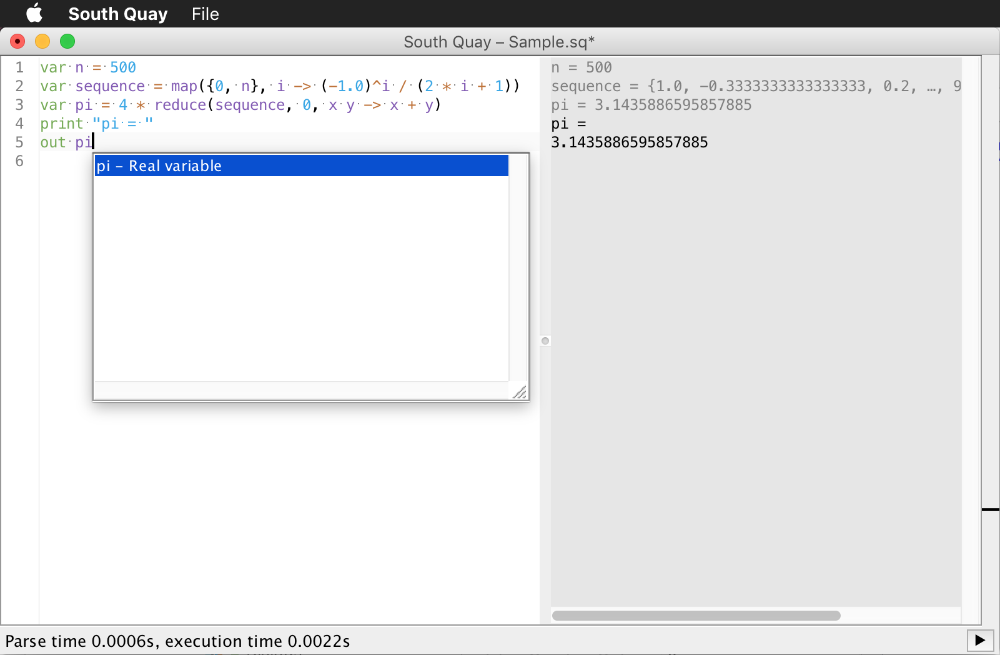

South Quay
==========

Interactive Editor and Interpreter

Arithmetics
-----------

**Note:** South Quay defaults to integer arithmetic (`out 3/2` => `1`), if only integer literals are used. However, values are automatically promoted to floating point arithmetic, if another operand is a real number (`out 3/2.0` => `1.5`).
